# degoog Toolkit

[degoog](https://github.com/fccview/degoog) store repository for SearXNG engines, plugins, and themes.

This repository is forked from and based on the work by [SiaoZeng](https://github.com/SiaoZeng) (from [degoog-searxng-extensions](https://github.com/SiaoZeng/degoog-searxng-extensions)).

We are incredibly grateful to the original authors and contributors in the `degoog` community whose tools, plugins, themes, and examples laid the foundation for this repository, including:

- **[Arkmind](https://github.com/Arkmind)** (creator of the Trankil plugin suite under the author name *arky*, including `calculator`, `stopwatch`, `tmdb`, etc.)
- **[Georgvwt](https://github.com/Georgvwt)** (creator of various slots and plugins like `reddit-slot`, `osm-slot`, `define-slot`, etc.)
- **[TheAnnoying](https://github.com/TheAnnoying)** (creator of the original `LiterallyGoogle` theme)
- **[Federico Dossena](https://github.com/adolfintel)** (creator of the underlying Speedtest)
- **Ben Ng** (creator of the unit/convert-units code)
- **[fccview](https://github.com/fccview)** (creator of degoog and various extensions)

## AI Usage Awareness

Before I started this repository, I forked it from https://github.com/SiaoZeng/degoog-searxng-extensions, which was coded alongside Claude, and as such, Claude is a contributor on this repo. I myself don't "vibe code", but AI was used in the making of these extensions, with a combination of Github Copilot used for autocompletions, and a local llm running on my own machine for longer completions.

## Included Themes

Click a theme to expand screenshots.

<details>
<summary><strong>LiterallyGoogle</strong> — Google-like results styling with a sticky header and full-width above-results plugin slots</summary>


</details>

## Included Plugins

Click a plugin name to expand screenshots and previews.

<details>
<summary><strong>Weather</strong> — Interactive charts, 7-day forecast, sunrise/sunset arc, and configurable units</summary>

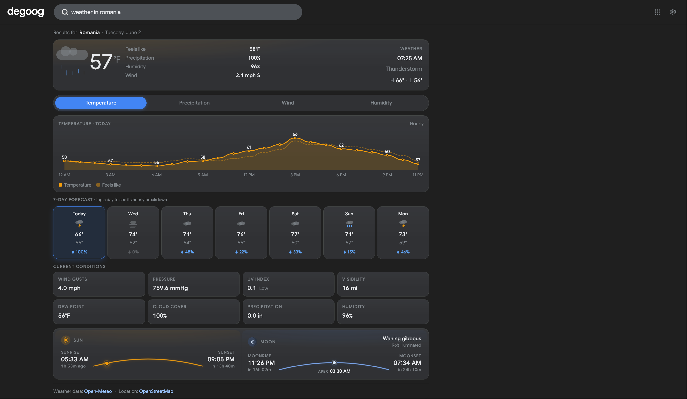


</details>

<details>
<summary><strong>Calculator</strong> — Scientific calculator with keypad and local canvas graphing</summary>

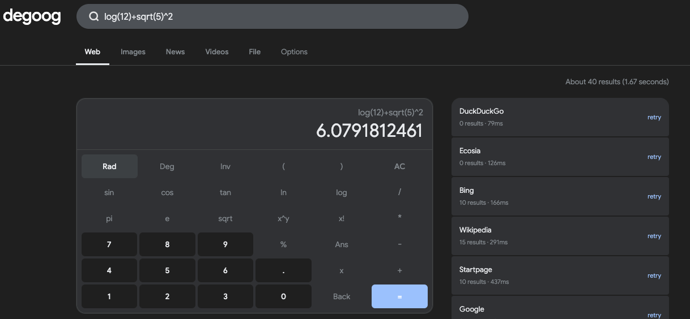

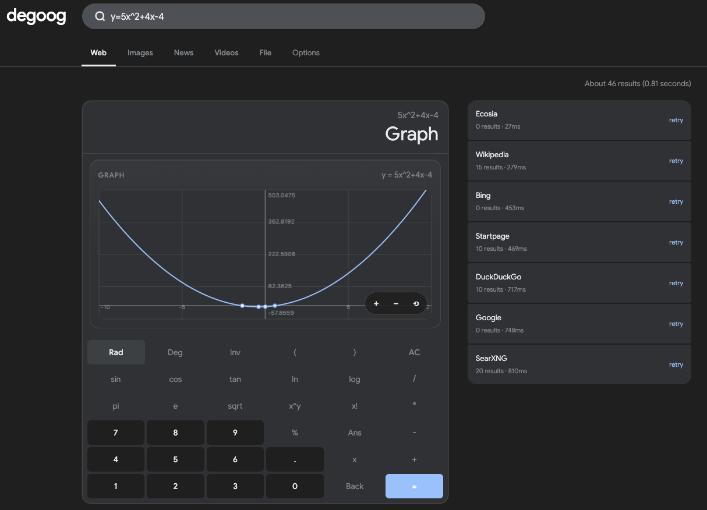

</details>

<details>
<summary><strong>Unit Converter</strong> — Fuzzy natural unit conversion (`25.4oz to ml`, `!unit 100c f`)</summary>


</details>

<details>
<summary><strong>Currency</strong> — Live fiat and crypto conversion (`100 usd to eur`, `!currency`)</summary>


</details>

<details>
<summary><strong>Translate</strong> — Server-side translation with provider switching and speech</summary>

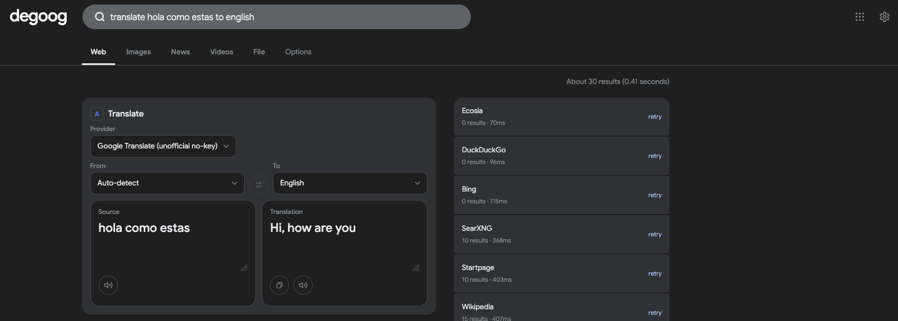

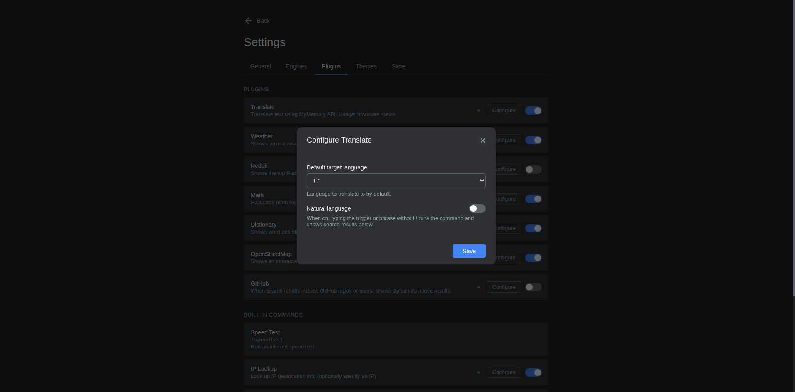

</details>

<details>
<summary><strong>Dictionary</strong> — Definitions, pronunciation, synonyms, and origin</summary>

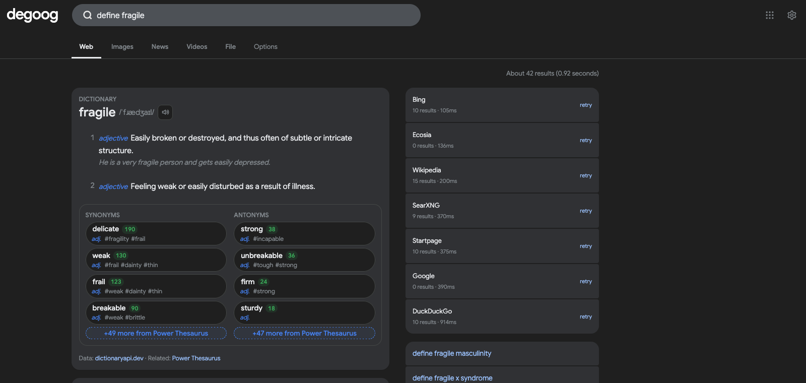


</details>

<details>
<summary><strong>Places</strong> — NLP-assisted local place cards with hours, phone, directions, and map (HERE API key required)</summary>

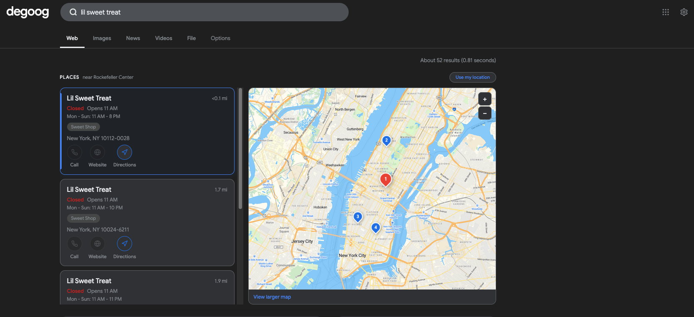

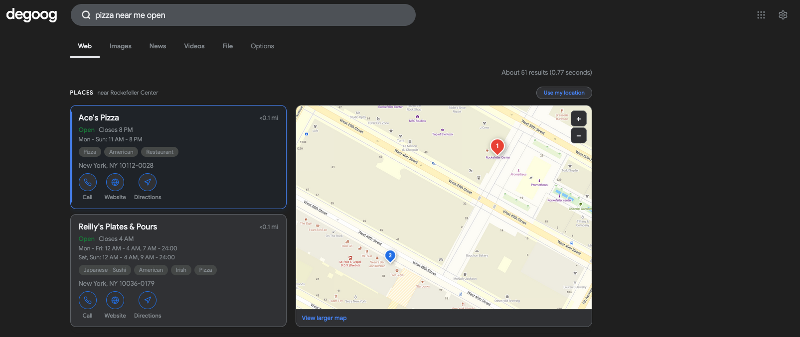

**Places** uses a vendored Compromise NLP parser plus conservative safety guards to recognize local intent without turning general searches into place cards. It keeps HERE as the rich POI/details provider and uses OpenStreetMap/Nominatim to validate NLP-derived location phrases and as a geocoding fallback. Supported shapes include bare business names like `Starbucks`, `Walmart`, `Target`, and `Subway`; explicit local queries like `Target near me`; category/location phrasing like `cafes around Chicago`; and landmark directions like `directions to Eiffel Tower`.

</details>

<details>
<summary><strong>Stocks</strong> — Stock quotes with Yahoo Finance data and chart ranges</summary>

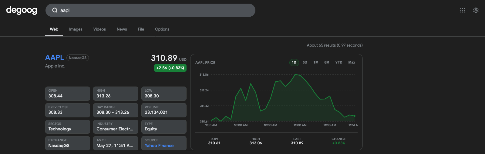

</details>

<details>
<summary><strong>TMDB</strong> — Movie, TV, and actor panels (TMDB API key required)</summary>


</details>

<details>
<summary><strong>Search History</strong> — Local history dropdown and `!history` view</summary>


</details>

<details>
<summary><strong>Speedtest</strong> — Speed test with gauge (`!speed`, `run a speedtest`)</summary>


</details>

<details>
<summary><strong>Until</strong> — Countdown answers (`years until 3000`, `!until 5pm`)</summary>

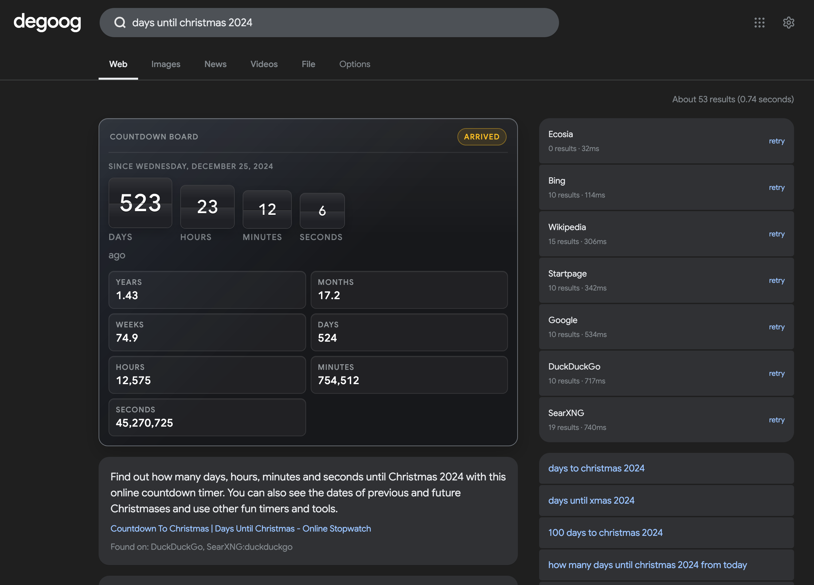

</details>

<details>
<summary><strong>Timer / Stopwatch</strong> — Timer and stopwatch with circular progress</summary>

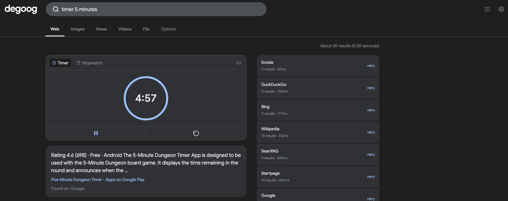

</details>

<details>
<summary><strong>Sports Results</strong> — Live scores, schedules, and standings (API keys required)</summary>

_No Store screenshots yet._ Example queries: `arsenal vs chelsea`, `lakers vs warriors`, `premier league standings`. Configure **football-data.org** and **BALLDONTLIE** keys in Settings → Plugins.

</details>

<details>
<summary><strong>Tip Calculator</strong> — Interactive tip and bill split (`tip 20% on $85`)</summary>

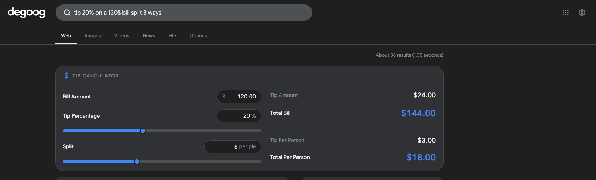

</details>

<details>
<summary><strong>Color Translator</strong> — HEX, RGB, HSL, named CSS, UIColor, and NSColor</summary>

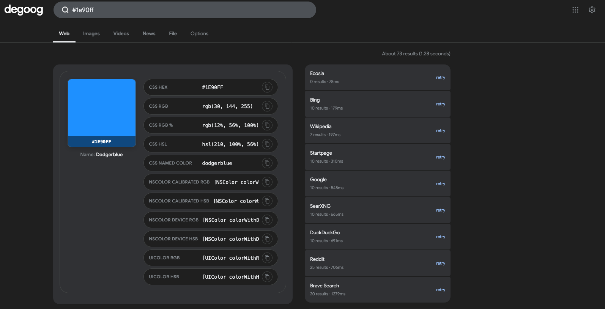

</details>

<details>
<summary><strong>Undecideds</strong> — Coin flip, dice, number pick, and yes/no tools</summary>

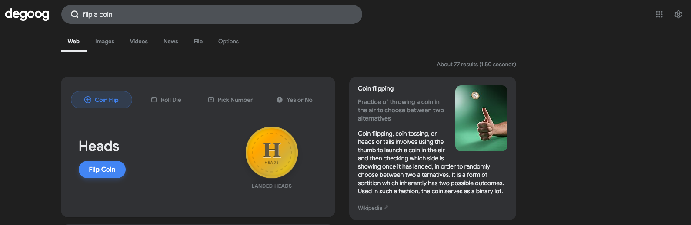

</details>

<details>
<summary><strong>Reddit</strong> — Top post and comments above results</summary>

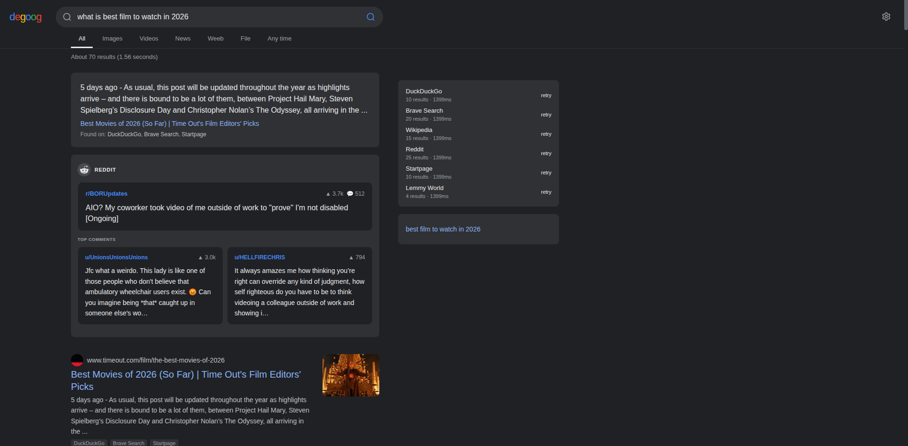

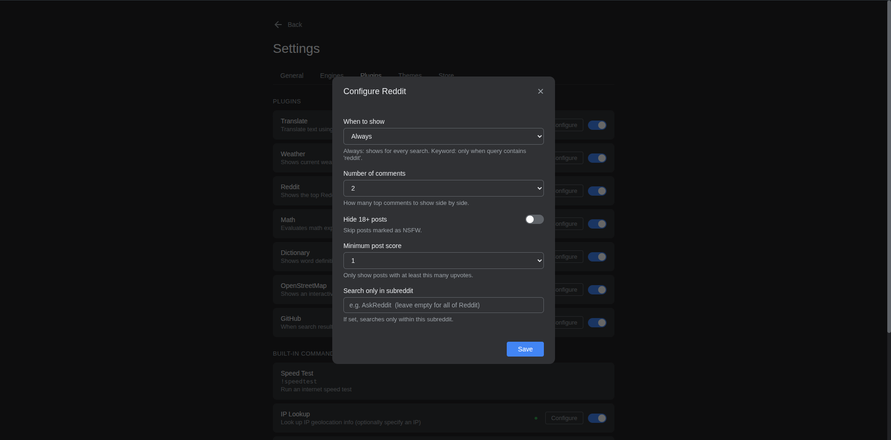

</details>

<details>
<summary><strong>Metronome</strong> — Tempo, tap tempo, and beat signatures</summary>

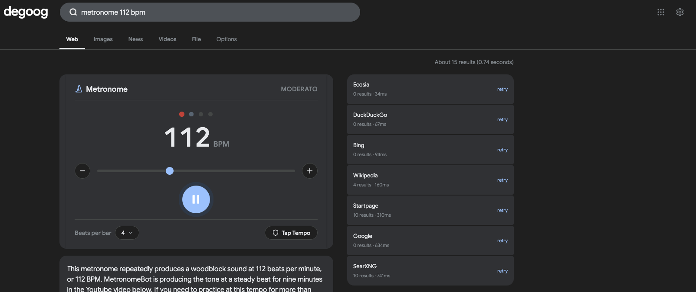

</details>

<details>
<summary><strong>Snake Game</strong> — Classic snake with mobile and fullscreen support</summary>

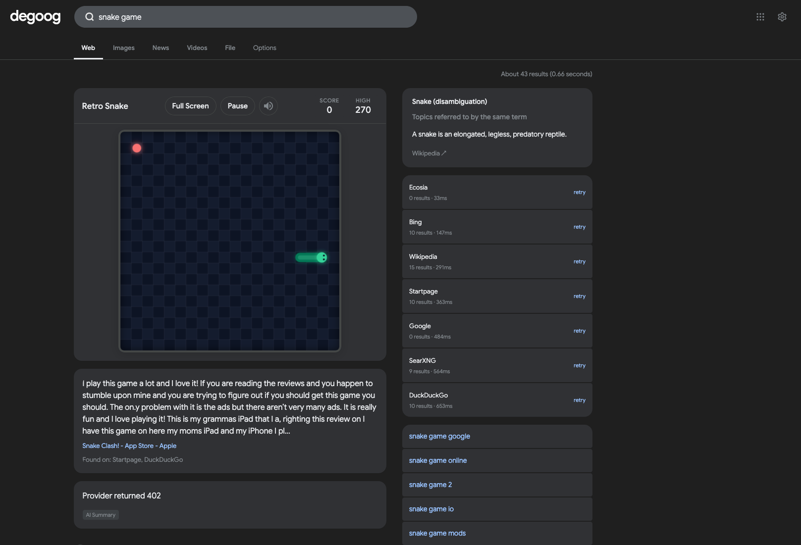

</details>

<details>
<summary><strong>Minesweeper</strong> — Play Minesweeper in search results</summary>

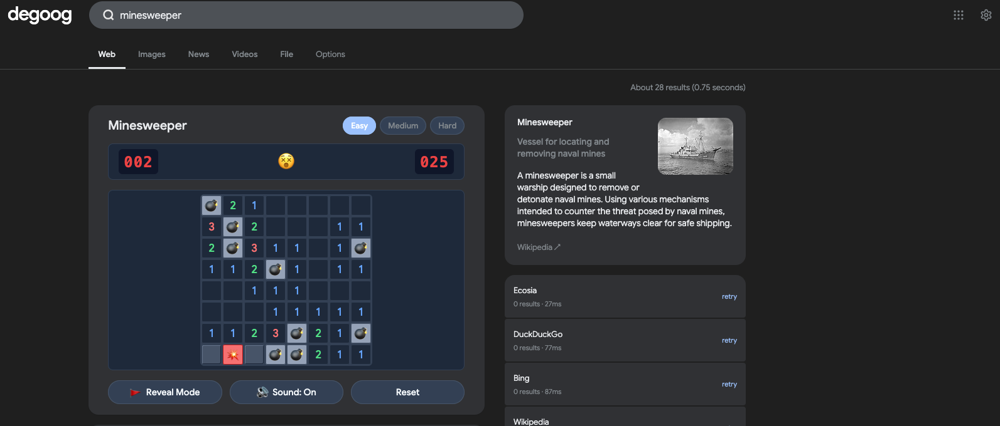

</details>

<details>
<summary><strong>Tic-Tac-Toe</strong> — Local multiplayer and AI difficulty</summary>

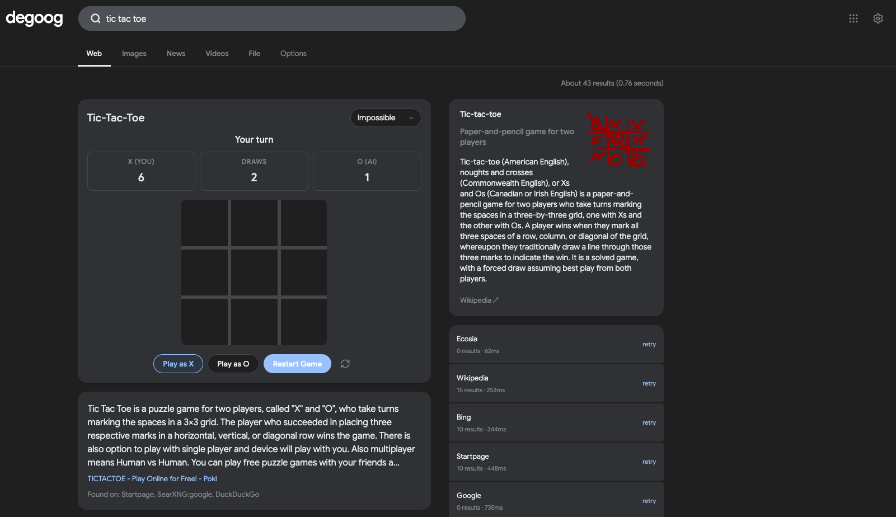

</details>

<details>
<summary><strong>Periodic Table</strong> — Interactive periodic table of elements with search, group highlighting, temperature-state simulator, and detail modals</summary>

_No screenshots yet._ Triggers on `periodic table`, `periodic table of elements`, `!periodic`, `!elements`, and `!ptable`.

</details>

### Speedtest details

**Speedtest** exposes:

- `!speed` as the primary trigger, avoiding degoog core's built-in `!speedtest` collision
- Natural-language phrases like `run a speedtest`, `speed test`, `speedtest`, `internet speed test`, `test my internet`, and `how fast is my internet` — Speedtest defaults its per-command **Natural language** toggle on for fresh installs. Trailing-keyword phrases like `"my internet speed test"` do **not** trigger because degoog's natural-language matcher is prefix-anchored; front-load the keyword.

> **Heads up — conflict with degoog's built-in `!speedtest`:**
> degoog core ships its own `!speedtest` command. This Store plugin uses `!speed` so it can still register while the built-in exists. Natural-language phrases such as `run a speedtest` route to this plugin when this command's Natural language setting is enabled.

### Color Translator details

**Color Translator** triggers when entering a color format:
- HEX (e.g., `#1e90ff` or `1e90ff`)
- RGB/RGBA (e.g., `rgb(30, 144, 255)`)
- HSL/HSLA (e.g., `hsl(210, 100%, 56%)`)
- CSS Named Color (e.g., `dodgerblue`, `tomato`)
- Swift/Objective-C code declarations (e.g., `[UIColor colorWithRed:0.118 green:0.565 blue:1 alpha:1]` or `[NSColor colorWithCalibratedHue:0.582 saturation:0.882 brightness:1 alpha:1]`)

It translates the color into HEX, RGB, RGB Percent, HSL, CSS Named, NSColor (calibrated/device RGB/HSB), and UIColor (RGB/HSB) with quick-copy buttons and a color swatch preview.

### Tip Calculator details

**Tip Calculator** triggers on query terms:
- `tip calculator`
- `calculate tip for 75 split by 3`
- `tip 20% on $85`
- `18% tip on 64`

It parses the bill, tip percentage, and split count directly from the query, and presents an interactive calculator with real-time bill split sliders, custom parameters, and animated value reveals.

### Undecideds details

**Undecideds** replaces the coinflip plugin with an interactive decision-making dashboard. Triggers include:
- **Coin Flip**: `coin flip`, `heads or tails`, `flip a coin` (features smooth 3D CSS coin spin animation)
- **Roll Die**: `roll a die`, `roll d20`, `roll d6` (features 3D/holographic animated rolling dice)
- **Pick Number**: `pick a number 1-100`, `random number 5 to 50` (features a staggered slot-machine digit-scrolling reveal and customizable range boundaries)
- **Yes or No**: `yes or no`, `should i` (features a rotating Yes/No wheel spinner with pointer wiggles and fun answers)

## Included Engines

This repo exposes SearXNG as multiple degoog search engines so each degoog tab can hit the matching SearXNG category:

- **SearXNG** — web/general results
- **SearXNG Images** — images
- **SearXNG Videos** — videos
- **SearXNG News** — news
- **SearXNG File** — files

All engines connect to your SearXNG instance via the JSON API.

**Shared settings (via Configure button):**
- **SearXNG URL** — Base URL of your instance (default: `http://127.0.0.1:8888`)
- **Categories** — Override the default category for that engine (for example `general`, `images`, `videos`, `news`, or `files`)
- **Engines** — Use specific SearXNG engines only (for example `google`, `bing`, `duckduckgo`, `wikipedia`)
- **Safe Search** — 0 (off), 1 (moderate), 2 (strict)

## Installation

1. Open degoog **Settings > Store**
2. Add this repository URL:
   ```
   https://github.com/SoPat712/degoog-toolkit.git
   ```
3. Install the SearXNG engines you want
4. Install the plugins or themes you want from this repository
5. Go to **Settings > Engines**, click **Configure** on each installed SearXNG engine, and set your instance URL
6. Go to **Settings > Plugins**, click **Configure** on any installed plugin that needs setup, and add its keys or preferences

## Prerequisites

A running SearXNG instance with JSON output enabled:

```bash
docker run -d --name searxng -p 8888:8080 \
  -e SEARXNG_SECRET=your-secret \
  searxng/searxng:latest
```

Make sure `json` is listed in `formats` in your SearXNG `settings.yml`:

```yaml
search:
  formats:
    - html
    - json
```

For the Sports Results plugin, users also need their own API keys:

- [football-data.org](https://www.football-data.org/client/register)
- [BALLDONTLIE](https://app.balldontlie.io)

TMDB also requires a user-supplied API key from [The Movie Database](https://www.themoviedb.org/settings/api).
